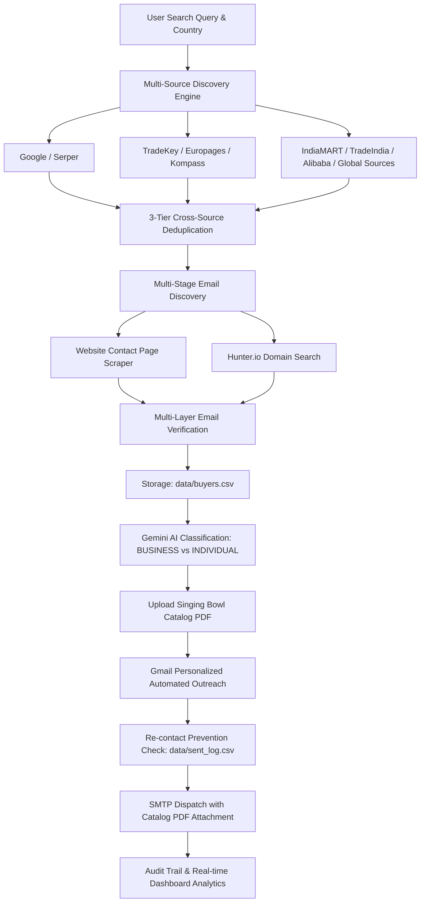

# API 3 – EXPORT Automation System

> **Singing Bowl Export Desk** – An end-to-end automated B2B export outreach and lead intelligence platform built with Python & Flask for the Himalayan / Tibetan Singing Bowl export trade.

---

## 🌟 Overview & Architecture

The **API 3 – EXPORT Automation System** is an automated pipeline designed to discover, enrich, qualify, and contact international buyers for artisanal Singing Bowl exports.



---

## 📋 Core Workflow

1. **Multi-Source Buyer Discovery**: Discovers wholesale importers, sound healing centers, meditation studios, and yoga distributors across Google/Serper, TradeKey, Europages, Kompass, IndiaMART, TradeIndia, Alibaba, and Global Sources.
2. **Structured Extraction**: Captures `buyer_name`, `company_name`, `email`, `website`, `country`, `source_platform`, `classification`, `status`, `created_at`.
3. **Cross-Source Deduplication**: Eliminates duplicates in strict precedence:
   - Normalized email
   - Root domain
   - Fuzzy company name + target country
4. **Website & Hunter.io Email Enrichment**: Crawls public contact subpages (`/contact`, `/contact-us`, `/about`, `/wholesale`) and queries Hunter.io with business prefix priority (`sales@` > `wholesale@` > `orders@` > `info@` > `contact@` > `business@`).
5. **Multi-Layer Email Cross-Checking**: RFC syntax checking, anti-disposable mailbox filtering, and DNS resolvability validation.
6. **Gemini AI Lead Qualification**: Uses Google Gemini API (`google-genai` SDK) to categorize leads into `BUSINESS` vs `INDIVIDUAL` buyers with structured JSON schema.
7. **Catalog PDF Management**: Drag-and-drop presentation catalog upload stored in `/uploads`.
8. **Personalized Gmail Outreach**: Dispatches personalized emails with `{buyer_name}`, `{company_name}`, `{country}` tokens and automatically attaches the export catalog PDF.
9. **Re-Contact Prevention**: Maintains an audit trail in `data/sent_log.csv` and updates buyer status to `CONTACTED` to guarantee no buyer is ever contacted twice.
10. **Real-time Analytics & Reporting**: Tracks Total Leads, Contacted Buyers, Emails Delivered, and Failed Delivery metrics.

---

## 📁 Project Structure

```
API3-EXPORT/
├── app.py                      # Flask core application & route controller
├── config.py                   # Central configuration & early .env loader
├── wsgi.py                     # WSGI server entry point
├── vercel.json                 # Vercel serverless deployment config
├── requirements.txt            # Python dependencies
├── .env.example                # Environment variables template
├── .gitignore                  # Git ignore rules for virtual environments & secrets
├── README.md                   # Project documentation
│
├── services/                   # Modular service layer
│   ├── __init__.py
│   ├── lead_sources/           # Modular B2B Lead Source Adapters
│   │   ├── __init__.py
│   │   ├── base_source.py      # Abstract Base Source Interface
│   │   ├── serper_source.py    # Google Search via Serper API
│   │   ├── tradekey_source.py  # TradeKey B2B marketplace adapter
│   │   ├── europages_source.py # Europages European directory adapter
│   │   ├── kompass_source.py   # Kompass global directory adapter
│   │   ├── indiamart_source.py # IndiaMART adapter
│   │   ├── tradeindia_source.py# TradeIndia adapter
│   │   ├── alibaba_source.py   # Alibaba Open Platform adapter
│   │   └── globalsources_source.py # Global Sources adapter
│   ├── search_service.py       # Multi-source discovery orchestrator & scraper
│   ├── hunter_service.py       # Hunter.io email finder & domain search
│   ├── verification_service.py # Email deliverability & DNS cross-checking
│   ├── gemini_service.py       # Gemini AI structured lead classification
│   └── gmail_service.py        # Gmail SMTP personalized email & catalog dispatcher
│
├── templates/                  # Jinja2 HTML templates
│   ├── base.html               # Base layout with navbar, alerts & footer
│   └── index.html              # Singing Bowl Export Desk Dashboard
│
├── static/                     # Static styling & client-side scripts
│   ├── css/
│   │   └── style.css           # Modern, responsive UI stylesheet
│   └── js/
│       └── app.js              # Client-side reactivity, validation & AJAX
│
├── data/                       # CSV persistence storage
│   ├── buyers.csv              # 9-column buyer database
│   └── sent_log.csv            # Dispatch audit trail and re-contact index
│
└── uploads/                    # Uploaded Singing Bowl export catalogs (PDF)
    └── catalog.pdf
```

---

## 🚀 Quickstart & Setup

### 1. Prerequisites
- Python 3.9+
- pip

### 2. Installation
```bash
# Clone the repository and navigate to root
cd API3-EXPORT

# Create and activate virtual environment
python -m venv .venv

# On Windows:
.venv\Scripts\Activate.ps1
# On macOS/Linux:
source .venv/bin/activate

# Install dependencies
pip install -r requirements.txt
```

### 3. Environment Variables
Copy `.env.example` to `.env`:
```bash
cp .env.example .env
```

Configure your `.env` keys:
```env
# Flask
FLASK_APP=app.py
FLASK_ENV=development
FLASK_DEBUG=True
FLASK_SECRET_KEY=your-secure-secret-key
PORT=5000

# Serper Google Search (https://serper.dev)
LEAD_SEARCH_API_KEY=your_serper_api_key
LEAD_SEARCH_API_URL=https://google.serper.dev/search

# Hunter.io Email Finder (https://hunter.io)
HUNTER_API_KEY=your_hunter_api_key

# Google Gemini AI (https://aistudio.google.com)
GEMINI_API_KEY=your_gemini_api_key
GEMINI_MODEL=gemini-3.6-flash

# Gmail SMTP Outreach
GMAIL_USER=your_email@gmail.com
GMAIL_APP_PASSWORD=your_16_char_google_app_password
```

### 4. Run the Application
```bash
python app.py
```
Access the dashboard at `http://localhost:5000`.

---

## 📡 API Endpoints

| Method | Endpoint | Description |
|---|---|---|
| `GET` | `/` | Main Export Desk dashboard rendering buyers, metrics, and logs. |
| `GET` | `/health` | Service health status and API configuration diagnostic. |
| `POST` | `/api/search` | Multi-source lead discovery with deduplication and enrichment. |
| `POST` | `/api/verify-emails` | Multi-layer email cross-check and deliverability verification. |
| `POST` | `/api/classify` | Google Gemini AI structured batch classification. |
| `POST` | `/api/upload-catalog` | Upload export presentation catalog PDF. |
| `GET` | `/api/catalog/status` | Retrieve active catalog file details. |
| `POST` | `/api/campaign/send` | Dispatch personalized Gmail campaign with catalog attachment. |
| `GET` | `/api/campaign/logs` | Fetch full outreach delivery logs from `sent_log.csv`. |

---

## 🧪 Testing

Run the full automated test suite:
```bash
python -m unittest discover -s "C:\Users\subhc\.gemini\antigravity\brain\91944bb5-3136-495f-bff1-5441bc4a441a\scratch" -p "test_*.py"
```

---

## ☁️ Deployment (Vercel & Gunicorn)

### Vercel Serverless
The repository includes `vercel.json` and `wsgi.py` for deployment:
```bash
npm install -g vercel
vercel
```

### Production Linux/WSGI (Gunicorn)
```bash
gunicorn --bind 0.0.0.0:5000 wsgi:app
```
